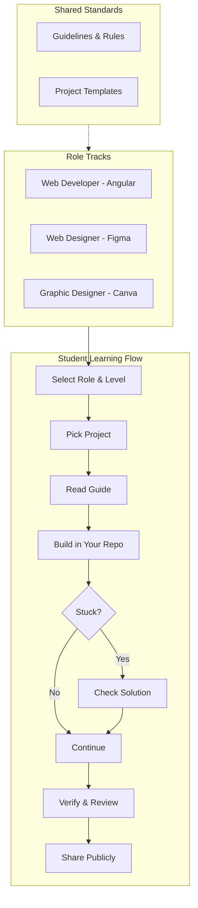

# Learn in Public Ecosystem

Welcome to the **Learn in Public Ecosystem**. This repository serves as a centralized learning hub for Web Developers, Web Designers, and Graphic Designers.

## 🧭 Navigation & Learning Model

This ecosystem is designed to be self-guided. The diagram below illustrates how components interact and how you should consume projects.

## 🚀 Getting Started

1.  **Choose your path**: Navigate to the folder corresponding to your role (`web-developer-angular`, `web-designer-figma`, or `graphic-designer-canva`).
2.  **Select a level**: Start with `beginner` if you are new, or challenge yourself with `advanced` or `hard`.
3.  **Pick a project**: specific project folders contain everything you need.
4.  **Follow the Guide**: Open the `guide/` folder and start with `01-overview.md`.
5.  **Build**: Create your own repository and build the project following the instructions.

## 🤝 Contributing

See [CONTRIBUTING.md](CONTRIBUTING.md) for details on how to add new projects or improve existing ones.
