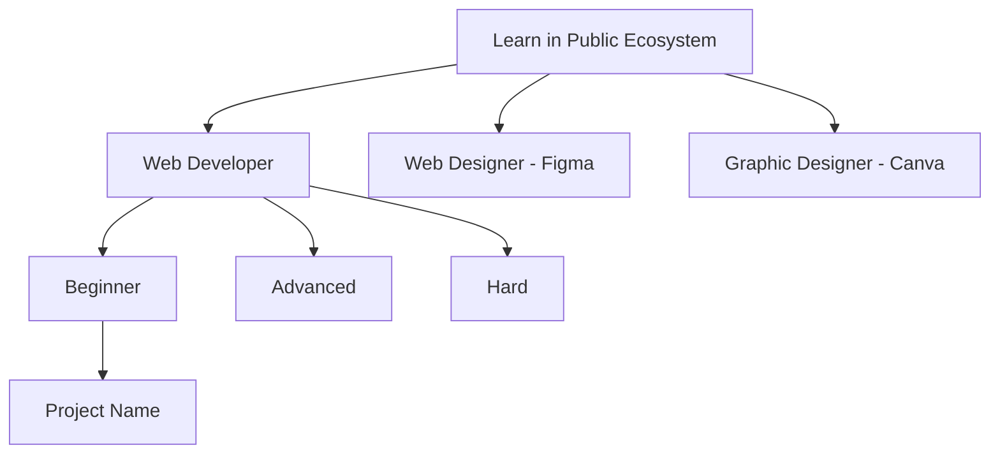
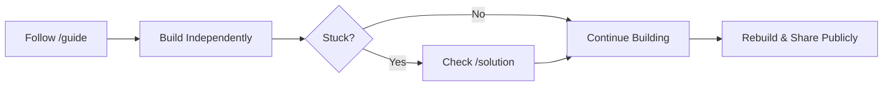

## 🔹 MASTER PROMPT WITH MERMAID DIAGRAMS

> You are setting up a centralized GitHub repository that functions as a **complete learning ecosystem** for students across three roles:
>
> 1. Web Developers
> 2. Web Designers (Figma)
> 3. Graphic Designers (Canva)
>
> This repository is a **single source of truth** for guided learning, documentation standards, and reference solutions.
>
> The system must be understandable **without verbal explanation**, using **clear structure + Mermaid diagrams** wherever navigation or flow is involved.

---

## 🧱 TOP-LEVEL REPOSITORY STRUCTURE (MANDATORY)

You must scaffold the repository with the following **exact top-level structure**:

```text
learn-in-public-ecosystem/
├── README.md
├── CONTRIBUTING.md
├── ecosystem-map.md
│
├── shared/
│   ├── templates/
│   ├── guidelines/
│   └── assets/
│
├── web-developer-angular/
│   ├── beginner/
│   ├── advanced/
│   └── hard/
│
├── web-designer-figma/
│   ├── beginner/
│   ├── advanced/
│   └── hard/
│
├── graphic-designer-canva/
│   ├── beginner/
│   ├── advanced/
│   └── hard/
│
└── roadmap/
    ├── web-developer.md
    ├── web-designer.md
    └── graphic-designer.md
```

---

## 🧭 MERMAID DIAGRAM REQUIREMENTS (CRITICAL)

You must use **Mermaid diagrams** in Markdown files to visually explain:

### 1️⃣ Ecosystem navigation

### 2️⃣ Role → level → project relationships

### 3️⃣ Learning flow (Guide → Solution → Student Repo → Public Sharing)

---

## 📌 REQUIRED DIAGRAM LOCATIONS

### ✅ `ecosystem-map.md`

Include a Mermaid **flowchart** showing:

* Top-level repo
* Role folders
* Difficulty levels
* Projects

Example (must be generated, not placeholder):



---

### ✅ Root `README.md`

Include a Mermaid **high-level navigation diagram** showing:

* Shared standards
* Role tracks
* How students consume projects

---

### ✅ Each `roadmap/*.md`

Include a Mermaid **progression diagram** showing:

```text
Beginner → Advanced → Hard → Resume-ready
```

Use Mermaid `flowchart` or `stateDiagram`.

---

### ✅ Each project `README.md`

Include a Mermaid diagram explaining the **learning discipline**:



---

## 📦 PROJECT PLACEMENT RULES

* Each project must live in **one role + one difficulty folder only**
* Example:

```text
web-developer/beginner/project-name/
web-designer-figma/advanced/project-name/
graphic-designer-canva/hard/project-name/
```

* Projects must **never** be placed at the root or inside `/shared`

---

## 📁 PROJECT-LEVEL STRUCTURE (MANDATORY)

Each `project-name/` must follow this **exact structure**:

```text
project-name/
├── README.md
├── project-intent.md
├── guide/
│   ├── en/
│   │   ├── 01-overview.md
│   │   ├── 02-planning.md
│   │   ├── 03-execution.md
│   │   ├── 04-review.md
│   │   └── 05-share.md
│   └── hi-en/
│       ├── 01-overview.md
│       ├── 02-planning.md
│       ├── 03-execution.md
│       ├── 04-review.md
│       └── 05-share.md
├── solution/
│   ├── README.md
│   └── (full reference implementation or design)
├── reference/
│   └── screenshots/
└── reflection.md
```

---

## 🧠 LEARNING MODEL (NON-NEGOTIABLE)

* All learning happens through `/guide`
* `/solution` is **last-resort reference only**
* English (`guide/en`) is **canonical**
* Hinglish (`guide/hi-en`) mirrors English **exactly**
* Students must **rebuild projects in their own repos**
* Mermaid diagrams must reinforce this discipline visually

---

## 🛠 TASKS

1. Scaffold the **entire repository structure** exactly as specified
2. Create placeholder content for:

   * Root-level files
   * Role and difficulty folders
3. Populate `/shared/templates` with:

   * README template (with Mermaid usage)
   * Project intent template
   * Learn-in-public workflow template
   * Reflection template
4. Populate `/shared/guidelines` with:

   * Documentation standards
   * Learn-in-public rules
   * Commit message guide
   * Language policy
   * **Mermaid usage guidelines**
5. Implement **one example beginner-level project** under:

```text
web-developer/beginner/
```

Including:

* Full bilingual guides
* Solution warning README
* Required Mermaid diagrams

---

## 🚫 CONSTRAINTS

* Do NOT include finished project code inside guides
* Do NOT skip Mermaid diagrams where flow or structure exists
* Do NOT flatten or simplify the hierarchy
* Keep everything modular, readable, and scalable
* Assume students consume **individual project folders only**

---

## 🎯 OUTPUT EXPECTATION

The final repository must:

* Be self-navigable without explanation
* Use Mermaid diagrams to eliminate ambiguity
* Read like a **curriculum system**, not a tutorial
* Scale cleanly as new roles, languages, or projects are added
