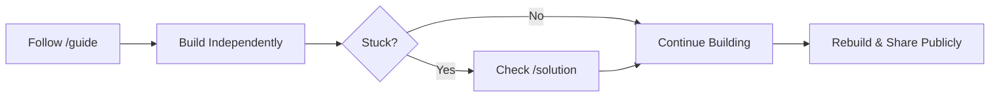

# [Project Name]

## 🎯 Goal
One-liner description of what the student will learn.

## 🧱 Learning Discipline

> [!IMPORTANT]
> Follow this flow strictly to maximize learning.

## 🛠 Tech Stack
- **Role:** [Web Dev / Designer]
- **Level:** [Beginner / Advanced]
- **Tools:** [List tools]

## 🚀 Instructions
1.  Read `project-intent.md` to understand the *why*.
2.  Navigate to `guide/en/01-overview.md` to start.
