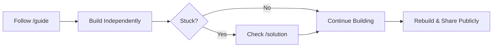

# Example Project

## 🎯 Goal
Build a simple personal bio page to learn HTML structure and basic CSS styling.

## 🧱 Learning Discipline

> [!IMPORTANT]
> Follow this flow strictly to maximize learning.

## 🛠 Tech Stack
- **Role:** Web Developer - Angular
- **Level:** Beginner
- **Tools:** HTML, CSS

## 🚀 Instructions
1.  Read `project-intent.md` to understand the *why*.
2.  Navigate to `guide/en/01-overview.md` to start.
